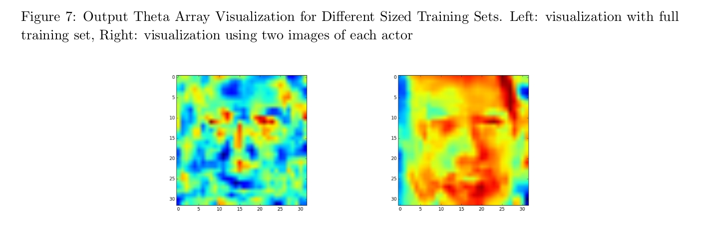

# Facial Classifier with Linear Regression

A simple face classifier, built with Numpy, Scipy, and Matplotlib. Ultimate accuracy of 0.85 on the test set, a subset of the FaceScrub data set. Read the report at `./report/faces.py`, and take a look at `faces.py` for the classifier.

Note: this project was conducted for CSC411: Machine Learning and Data Mining, at the University of Toronto.